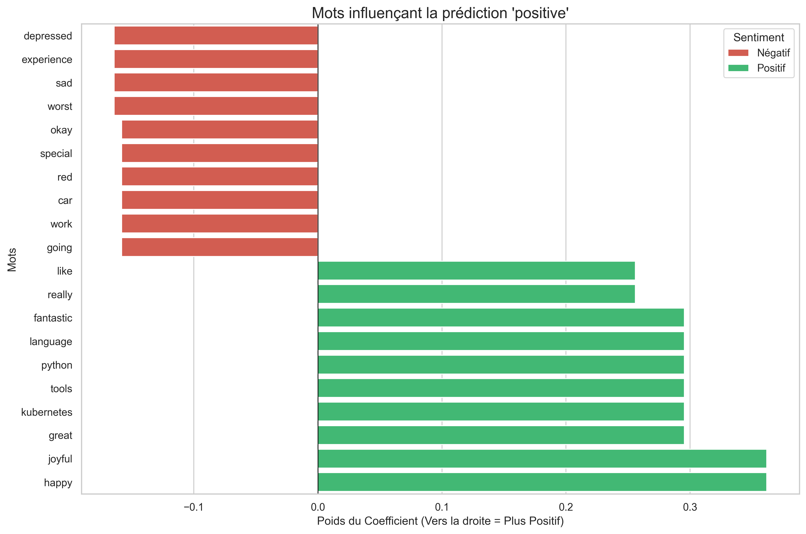

# API d'Analyse de Sentiments MLOps


## Résumé

Installer docker installer minikube (Dans requirements ajt makefile)

Ce projet présente une API complète d'analyse de sentiment.
Il implémente une **architecture MLOps** prête pour la production :

1.  **Machine Learning** : Entraînement d'un modèle de Régression Logistique sur un dataset personnalisé (`pandas`, `scikit-learn`) et sérialisation (`joblib`).
2.  **Développement API** : Exposition du modèle via (`FastAPI`).
3.  **Conteneurisation** : Dockerisation de l'application pour garantir la reproductibilité (`Docker`).
4.  **Infrastructure as Code (IaC)** : Automatisation du déploiement sur un cluster Kubernetes local (`Terraform`).
5.  **Tests** : Tests d'API automatisés (`Bruno`).

---

## Architecture

Le projet suit une séparation entre l'entraînement et l'utilisation :

* **Phase d'Entraînement (Training) :** Le script `train_model.py` utilise le fichier `dataset.csv`, pré-traite le texte (vectorisation TF-IDF), entraîne le modèle et sauvegarde le cerveau dans un fichier binaire (`sentiment_model.pkl`).
* **Phase d'Inférence (Serving) :** L'API charge ce fichier `.pkl` au démarrage pour servir des prédictions instantanées sans avoir besoin de ré-entraîner le modèle.

---

## Visualisation & Interprétation du Modèle (Et sa limite)

Pour comprendre comment le modèle prend ses décisions, nous avons extrait les coefficients de la Régression Logistique.
Le graphique ci-dessous montre les mots qui influencent le plus la décision vers "Positif" (Vert) ou "Négatif" (Rouge).



### Pourquoi des mots neutres semblent "polarisés" ?
On remarque que des mots techniques à priori neutres (comme `python`, `kubernetes` ou `service`) apparaissent fortement colorés.

Cela s'explique par le **biais du jeu de données (Dataset Bias)** :
Comme le dataset d'entraînement est réduit, le modèle fonctionne par association directe.
* Si le mot `python` apparaît souvent dans une phrase contenant `amazing`, le modèle va déduire que `python` est un mot positif en soi.
* Inversement, si `service` apparaît souvent à côté de `awful`, il sera considéré comme négatif.

---

## Comment lancer le projet

### Prérequis

* Python 3.11+
* Docker Desktop / Minikube
* Terraform
* Git
* Make

### Option 1 : Démarrage rapide (Via Makefile)
L'ensemble du pipeline (Installation, Entraînement, Build Docker, Minikube, Terraform) est automatisé.

```bash
make first-run
```

### Option 2 : Démarrage rapide (Via Makefile)

### 1. Entraînement du Modèle
Générer l'artefact (`.pkl`) à partir des données brutes.

```bash
# Installer les dépendances
pip install -r requirements.txt

# Lancer l'entraînement
python train_model.py
```

### 2. Construction Docker
Packager l'API

```bash
docker build -t sentiment-api .

# (Si utilisation de Minikube) Charger l'image dans le cluster
minikube image load sentiment-api:latest
```

### 3. Déploiement (IaC)
Déployer l'infrastructure sur Kubernetes via Terraform.

```bash
cd terraform
terraform init
terraform apply
```

### 4. Accès à l'API
Récupérer l'URL du service :

```bash
minikube service sentiment-api-service --url
```
Ajoutez /docs à l'URL pour tester via Swagger UI.

## Structure du Projet

```bash
.
├── dataset.csv            # Données brutes
├── train_model.py         # Pipeline ML
├── sentiment_model.pkl    # Modèle généré
├── main.py                # API FastAPI
├── Dockerfile             # Configuration Docker
├── terraform/             # Scripts de déploiement Kubernetes
└── sentiment api/         # Tests Bruno
```

## Nettoyage
Pour supprimer les ressources créées :

```bash
cd terraform && terraform destroy
minikube stop
```